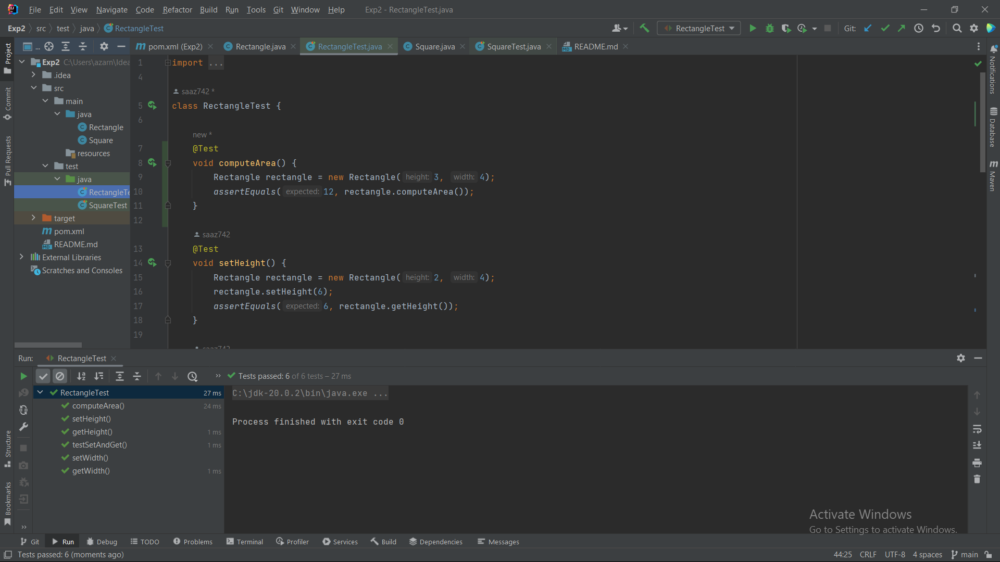
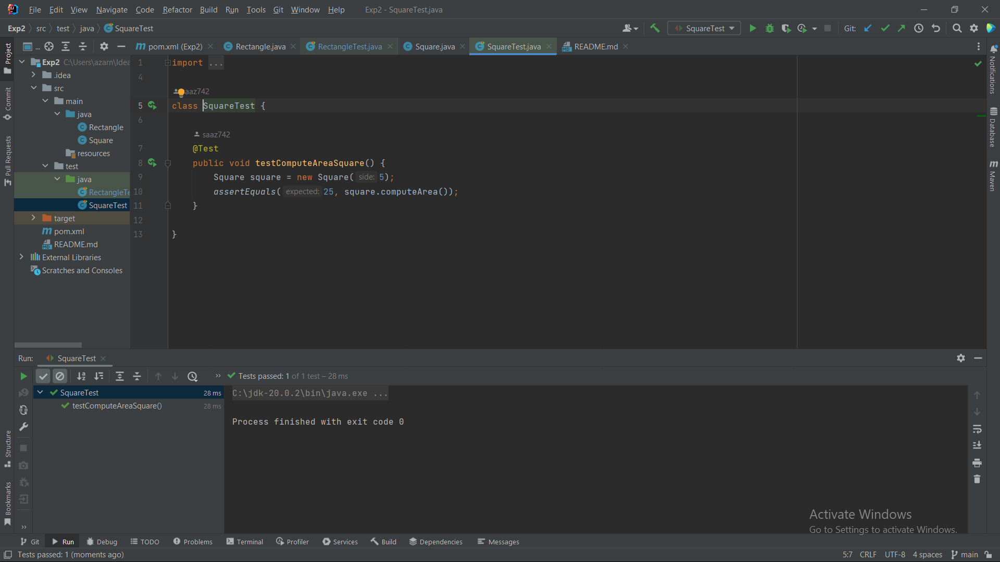

# Practical application of SOLID object orientation principles using Test Driven Development (TDD) method
کاربرد عملی اصول شئ‌گرایی SOLID با استفاده از روش (TDD) Test Driven Development

 ### دستور کار:

https://github.com/ssc-public/Software-Engineering-Lab/blob/main/agendas/SOLID.md

### مراحل انجام آزمایش:
- در ابتدا یک پروژه جاوا در محیط intellij idea و maven میسازیم سپس dependency برای junit را اضافه میکنیم.
- از روش TDD استفاده میکنیم بنابراین ابتدا باید تست ها را نوشته و سپس کلاس ها را بنویسیم این روش برای پیاده سازی کمک بسیاری میکند.
- کلاس تست را برای مستطیل میسازیم که با گرفتن طول و عرض مساحت مستطیل را تست کند.
- سپس کلاس Rectangle میسازیم که طول و عرض مستطیل را میگیرد و با تابع computeArea مساحت را محاسبه میکند.
- تست را اجرا میکنیم و در صورت مشکل تابع را اصلاح کرده و مجدد تست میکنیم تا جواب مناسب دهد.
- سپس برای تمام تایع ها شامل getter و setter های طول و عرض تست مینویسیم. در آخر نیز یک تابع با استفاده از تمام توابع با هم مینویسیم که در آخر مساحت را محاسبه کند.
- سپس برای آنکه بتوانیم طول و عرض مستطیل را تغییر دهیم، برای هر کدام یک تابع set برای مقداردهی و یک تابع get برای گرفتن مقادیر میسازیم.
- تست های جدید را اجرا میکنیم و در صورت مشکل تابع را اصلاح کرده و مجدد تست میکنیم تا جواب مناسب دهد.
- برای مربع نیز یک کلاس تست ایجاد میکنیم. چون در اینجا مربع از مستطیل ارث بری میکند و مستطیل را تست کرده ایم تنها یک تست برای ورودی و صحت مینویسیم.
- ویژگی های گفته شده در صورت سوال برای ارث بری مربع از مستطیل است بنابراین برای ساخت مربع از اصول شی گرایی استفاده کردیم. (بهتر است کلاس پدری مانند شکل ایجاد کنیم اما در این پروژه ارث بری مربع از مستطیل مدنظر است.) مربع به جای دو متغیر طول و عرض مستطیل یک متغیر ورودی میگیرد و همان را برای هر دو مقدار میدهد.
- در آخر تست مربع را ران میکنیم و نتیجه را مشاهده میکنیم اگر مشکلی در تست ها باشد میتوان تابع مورد نظر آن تست را اصلاح کرد.

### عکس های صحت تست:

## پرسش‌ها

  - هر یک از پنج اصل SOLID را در دو الی سه خط توضیح دهید.
    
    - اصل مسئولیت واحد (Single Responsibility Principle (SRP)):
     
      این اصل بیان می‌کند که هر کلاس، ماژول یا تابع باید فقط یک مسئولیت را بر عهده داشته باشد. یعنی هر قسمت از کد باید تنها به انجام یک کار مشغول باشد.
      
      این اصل باعث می‌شود که کد قابلیت نگهداری و تغییر بالاتری داشته باشد، چرا که هر تغییر در یک مسئولیت، تنها تغییراتی را در کد ایجاد می‌کند که به آن مسئولیت مربوط است.

    - اصل باز-بسته (Open-Closed Principle (OCP)):
   
      این اصل بیان می‌کند که یک کلاس باید برای تغییر بسته باشد، اما برای توسعه باز باشد.
      به این معنی که وقتی یک نیاز جدید به کد اضافه می‌شود، باید بتوانیم آن را در کد اضافه کنیم، بدون این که تغییرات زیادی در کد موجود ایجاد شود.
      
      این اصل باعث می‌شود که کد قابلیت توسعه بیشتری داشته باشد.

    - اصل جایگزینی لیسکوف (Liskov Substitution Principle (LSP)):
   
      این اصل بیان می‌کند که هر زیرکلاس باید قابل جایگزینی با کلاس پدر خود باشد، بدون این که باعث شکست کد شود.
      به این معنی که هر تابعی که برای کار با یک کلاس پدر نوشته شده است، باید بتواند همان‌طور که استفاده می‌شود، با هر زیرکلاسی از آن کلاس نیز کار کند.

      این اصل باعث می‌شود که کیفیت کدها، انعطاف‌پذیری و قابلیت استفاده مجدد (reusability) کدها و همچنین سرعت توسعه نرم‌افزارها افزایش می یابد.
      
    - اصل جداسازی رابط  (Interface Segregation Principle (ISP)):
      
      این اصل می‌گوید که باید برای هر کاربرد، یک رابط کوچک و خاص طراحی کنیم، به جای آن که یک رابط بزرگ و کلی برای همه کاربردها داشته باشیم.
      
      این اصل باعث می‌شود که کلاس‌ها فقط به آن چیزی که نیاز دارند وابسته باشند، به جای اینکه به چیزهایی که نیاز ندارند وابسته باشند.
      
    - اصل وارونگی وابستگی(Dependency Inversion Principle (DIP)):
  
      این اصل بیان می‌کند که کلاس‌ها باید به یک رابط وابسته باشند، نه به یک کلاس خاص. به این معنی که کلاس‌ها باید به یک معنی تعمیمی و عمومی وابسته باشند، نه به جزئیات پیاده‌ای از کلاس‌های خاص.
      
      این اصل باعث می‌شود که کلاس‌ها قابلیت تغییر بیشتری داشته باشند، چرا که تغییرات در کلاس‌های خاص، نه تنها تغییراتی در آن کلاس‌ها بلکه تغییراتی در کلاس‌های وابسته به آن کلاس‌ها نیز ایجاد می‌کند.
      با این اصل، تغییرات در یک کلاس فقط تغییراتی در رابطهای آن کلاس ایجاد می‌کند، و دیگر کلاس‌های وابسته به آن تحت تاثیر قرار نمی‌گیرند.
      
   - اصول SOLID در کدام یک از گام‌های اصلی ایجاد نرم‌افزار (تحلیل نیازمندی‌ها، طراحی، پیاده‌سازی، تست و استقرار) استفاده می‌شوند؟ توضیح دهید.
    
     در همه‌ی گام‌های ایجاد نرم‌افزار (تحلیل نیازمندی‌ها، طراحی، پیاده‌سازی، تست و استقرار) به کار می‌روند.
  
      - تحلیل نیازمندی‌ها:
        
        در این مرحله، اصل SRP برای تعریف وظایف مختلف سیستم و اصل ISP برای تعریف رابط‌های مربوط به هر وظیفه از اهمیت بالایی برخوردارند.
      - طراحی:
        
        در این مرحله، اصل SRP برای طراحی کلاس‌هایی با مسئولیت واضح و اصل OCP برای طراحی کلاس‌هایی با امکان گسترش و عدم نیاز به تغییر کد موجود از اهمیت بالایی برخوردارند.
      - پیاده‌سازی:
        
        در این مرحله، اصل SRP به کار گرفته می‌شود تا هر کلاس فقط یک مسئولیت داشته باشد و اصل OCP برای پیاده‌سازی کلاس‌هایی با امکان گسترش و عدم نیاز به تغییر کد موجود از اهمیت بالایی برخوردارند.
      - تست:
        
        در این مرحله، اصل SRP به کار گرفته می‌شود تا هر تست فقط یک مورد را بررسی کند و اصل LSP برای اطمینان از اینکه هر کلاسی که از یک کلاس پایه ارث‌بری کرده است، در همه‌ی موارد می‌تواند جایگزین آن باشد، از اهمیت بالایی برخوردارند.
     
      - استقرار:
        
        در این مرحله، اصل DIP برای وابستگی به ابسترکشن‌ها به جای وابستگی به جزئیات، از اهمیت بالایی برخوردار است.
        
 - در چرخه‌ی عمومی ایجاد نرم‌افزار، آزمون نرم‌افزار دیرتر از پیاده‌سازی نرم‌افزار انجام می‌شود، اما در روش TDD تست‌نویسی پیش از پیاده‌سازی شروع می‌شود. آیا این دو مورد با هم تناقضی دارند؟ توضیح دهید.

   در واقع، روش TDD یا Test Driven Development به اصل آزمون و اصل OCP توجه می‌کند. هدف از این روش، نوشتن کدی است که تنها به اندازه‌ی لازم و کافی برای پاسخ‌دهی به تست‌های موردنظر نوشته شود
   و از اصل OCP برای طراحی کلاس‌هایی استفاده می‌شود که به راحتی گسترش پذیر هستند. این روش بیشتر برای پیاده سازی استفاده میشود و هدف اصلی تست کردن نیست.
   در واقع، با شروع از نوشتن تست‌های موردنظر و سپس نوشتن کد مربوط به آن‌ها، کد به طور خودکار با اصل OCP سازگار می‌شود. بنابراین، این دو مورد با هم تناقضی ندارند و در واقع، مکمل یکدیگر هستند.
    
 - فرض کنید در آزمایش بالا نیازی به تغییر ابعاد مستطیل نداشتیم. آیا در این حالت می‌توانستیم مربع را از مستطیل به ارث ببریم؟ توضیح دهید.
   
   خیر - در اینجا میتوانیم طول و عرض مستطیل را تغییر بدهیم. و به این دلیل مربع از مستطیل ارث بری میکند. اما مربع است و نباید از مستطیل ارث بری کند.
   مربع دارای رفتار و خصوصیات متفاوتی نسبت به مستطیل است که در مستطیل نیست و این رفتار و خصوصیات باید در کلاس مربع تعریف شوند.
   در نتیجه، بهتر است که کلاس مربع به عنوان یک کلاس جداگانه تعریف شود و از مستطیل به عنوان یک کلاس پایه استفاده نشود. از کلاسی مانند شکل استفاده شود.

