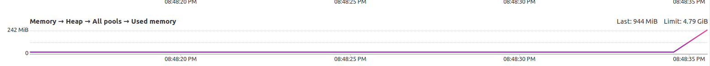

# SELab5 (Profiling)
تمرین پنجم آزمایشگاه مهندسی نرم‌افزار - تابستان ۱۴۰۲

*امیر معینی، سارا آذرنوش*

 ### دستور کار:
https://github.com/ssc-public/Software-Engineering-Lab/blob/main/agendas/profiling.md
 
# بخش اول

بعد از نصب YourKit 
و پلاگین آن در IntelliJ
متد `main`
در `JavaCup`
را طبق تصویر زیر پروفایل می‌کنیم:

**۱. شروع پروفایلینگ**

**۲. وارد کردن ورودی‌ها**

**۳. پایان پروفایلینگ بعد از مدتی**

**۴. نتیجه پروفایلینگ**

همانطور که در نتیجه می‌بینیم اکثر زمان ترد `main`
در متد
`temp`
سپری شده‌است. البته اکثر بقیه‌ی زمان را نیز منتظر ورودی ما بوده است(
    در توابع `Scanner.nextInt()`
)
بنابراین تقریبا کل زمان برنامه را همین تابع `temp`
گرفته است.

با کلیک راست روی این تابع مستقیم به کد آن در IDE
می‌رویم:

همانطور که در کد این تابع مشاهده می‌کنیم، یک `ArrayList`
با طول صفر ساخته‌ایم و در طی دو حلقه، تعداد معلومی درایه به آن اضافه کرده‌ایم. با توجه به پیاده‌سازی `ArrayList` به وسیله
dynamic array
این کار با اینکه به صورت سرشکن هزینه کمی دارد ولی وقتی طول آرایه‌را از قبل می‌دانیم، بهتر است همان اول آن را با آن طول بسازیم:

حال دوباره پروفایل می‌کنیم:

همانطور که می‌بینیم این دفعه تابع `temp`
به طرز قابل توجهی سریعتر اجرا شده‌است.

تفاوت مهم دیگری که بین این دو کد وجود دارد، استفاده از حافظه است. در حالتی که هیچ اندازه‌ای به `ArrayList`
ندهیم، با توجه به اینکه این کلاس از `dynamic array`
استفاده می‌کند، ممکن است در مراحل پایانی به اندازه‌ای بسیار بیشتر از اندازه‌ای که ما نیاز داریم گسترش یابد. با مراجع به بخش Memory
در YourKit 
می‌بینیم که این اتفاق افتاده است:

ولی وقتی که اندازه را از قبل به `ArrayList`
مشخص می‌کنیم حافظه بیشتر از چیزی که نیاز داریم allocate
نمی‌شود:

# بخش دوم

می‌خواهیم کدی برای جمع دو آرایه بزرگ بزنیم. ابتدا این کار را به وسیله تابع `add`
اینجام می‌دهیم:

کد را پروفایل می‌کنیم و نتیجه را می‌بینیم:

همانطور که مشاهده می‌کنیم، بیشترین زمان(بجز زمانی که برای allocate کردن آرایه‌ها صرف کرده‌ایم که اجتناب ناپذیر است)
مربوط به تابع `add` 
است. حال این تابع را به وسیله `vector`
پیاده‌سازی می‌کنیم. این api 
از دستورات SIMD 
پردازنده استفاده می‌کند که برای پردازش موازی داده‌ها طراحی شده‌اند:

حال این تابع را جایگزین `add`
می‌کنیم و دوباره پروفایل می‌کنیم:

همانطور که مشاهده می‌کنیم زمان صرف شده برای جمع زدن دو آرایه تقریبا به یک نهم کاهش یافته‌است.

لازم به ذکر است که این دو کد از لحاظ بقیه منابع یکسان هستند:

