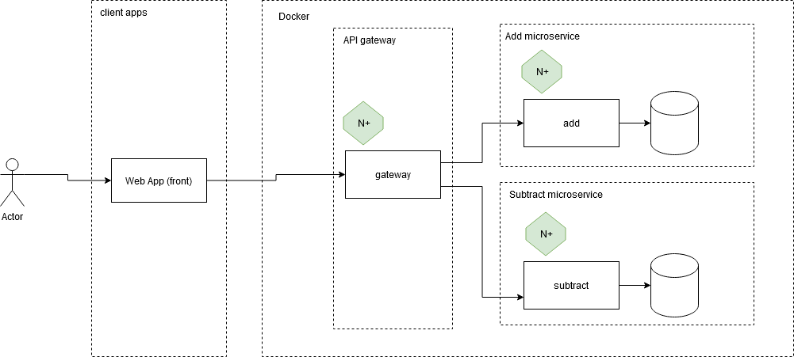
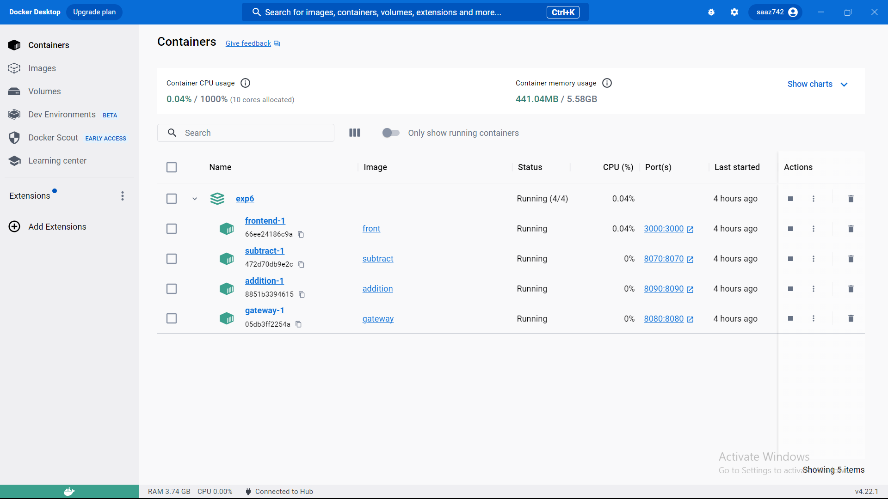
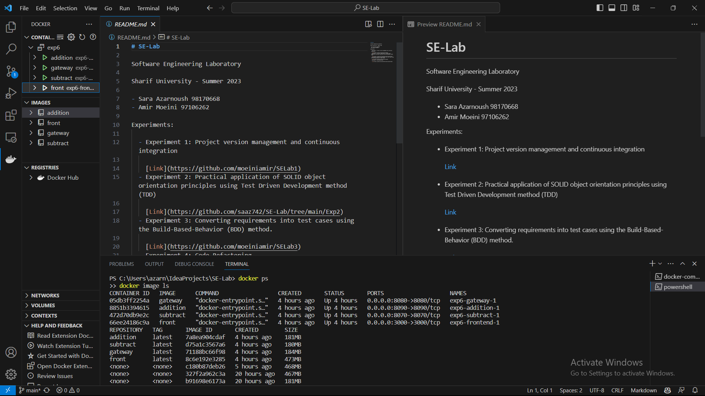
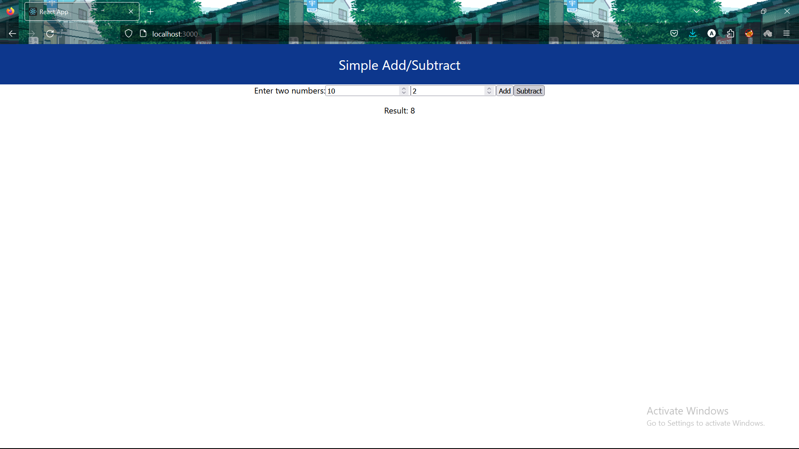
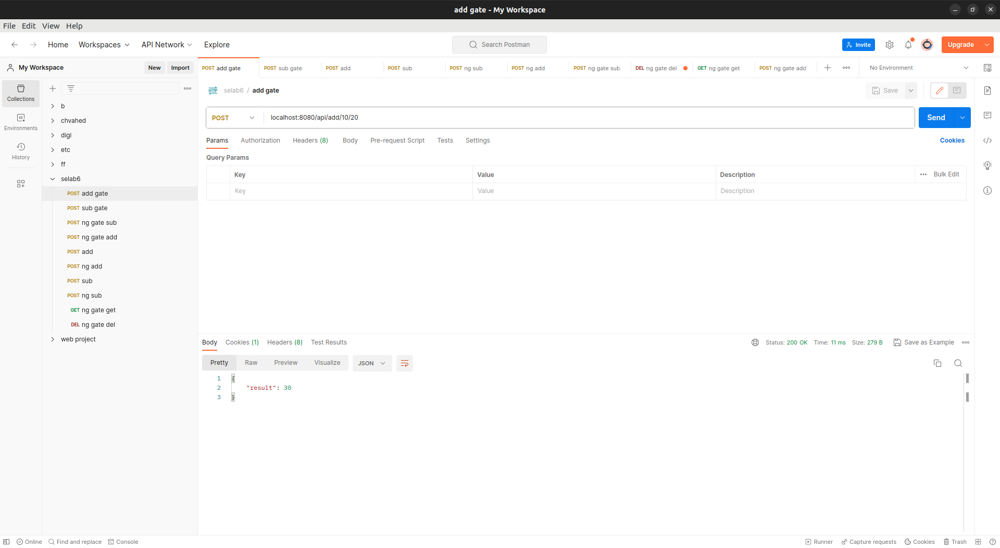
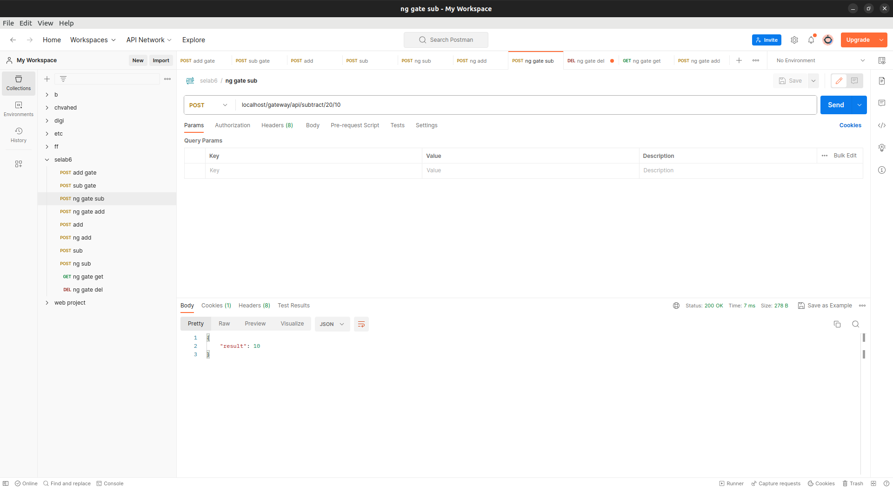
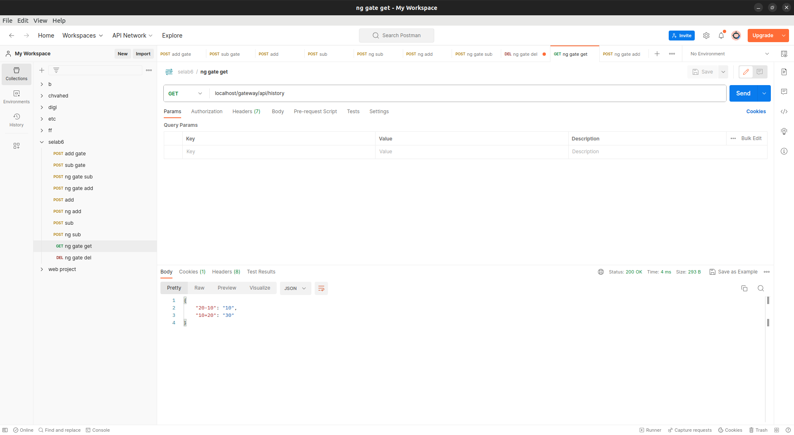
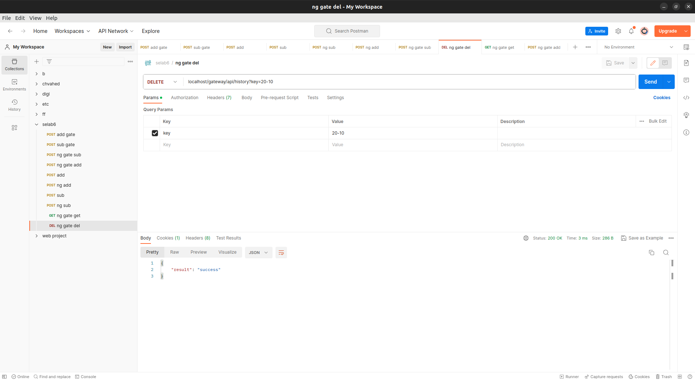

# Deploying a MicroService-based software using Docker

استقرار یک نرم افزار مبتنی بر MicroService به کمک Docker

پروژه 6 آزمایشگاه مهندسی نرم افزار

سارا آذرنوش, 
امیر معینی

## دستور کار:

[Github](https://github.com/ssc-public/Software-Engineering-Lab/blob/main/agendas/docker.md)

## UML:
[drawo.io]()



#  ساخت پروژه:

این آزمایش از چهار بخش تشکیل شده است:

 - 2 میکرو سرویس add و subtract که مسول انجام عملیات جمع و تفریق هستند.
 - 1 میکرو سرویس gateway که مسول ارتباط با سرویس های دیگر و ارسال درخواست ها به آن ها می باشد.
 - 1 میکرو سرویس front که مسول ارتباط با کاربر و نمایش نتیجه محاسبات می باشد.

در ابتدا هر بخش به روش های زیر ایجاد و به دو روش داکر و نود اجرا می شوند.

برای ساخت این پروژه از زبان های javascript و react استفاده شده است.

## Front

  یک پروژه ی جدید با نام font ایجاد می کنیم.
در و یک پروژه ی ری اکت با نام myapp   و  یا بدون نام در front ایجاد می کنیم.

```shell
cd .\front
npx create-react-app myapp
# npx create-react-app .
```
سپس در فولدر src تولید شده تغییرات مورد نظر را اعمال میکنیم.

در پروژه ی ما به 2 محل برای وارد کردن اعداد و دو دکمه ی جمع و تفریق نیاز است.
همچنین به گیتوی متصل میشویم تا به
میکروسرویس مورد نظر متصل شود و نتیجه ی محاسبات را نمایش دهد.

## Gateway

در این بخش یک پروژه ی جدید با نام gateway ایجاد می کنیم.
وظیفه ی gateway اتصال میکروسرویس ها به فرانت و برسی درخواست ها و اطلاعات است.

2 تابع برای 2 میکروسرویس خود ایجاد میکنیم که اعداد داده شده را به آن ها میفرستد و نتیجه را دریافت میکند.

## Add

در این بخش یک پروژه ی جدید با نام add ایجاد می کنیم. وظیفه ی این میکروسرویس انجام عملیات جمع است. این میکروسرویس یک تابع دارد که دو عدد را جمع میکند و نتیجه را برمیگرداند.

## Subtract

در این بخش یک پروژه ی جدید با نام subtract ایجاد می کنیم. وظیفه ی این میکروسرویس انجام عملیات تفریق است. این میکروسرویس یک تابع دارد که دو عدد را تفریق میکند و نتیجه را برمیگرداند.

## موارد مورد نیاز
برای ساخت package-lock.jsonمیتوان به فولدر مورد نظر رفت و دستور زیر را وارد کرد.


```shell
npm install --package-lock-only
```
 پورت های داده شده به هر بخش:
 - front: 3000
 - subtract: 8070
 - gateway: 8080
 - add: 8090

خالی کردن پورت های اشغال شده.
```shell
npx kill-port 8090
npx kill-port 3000
npx kill-port 8070
npx kill-port 8080
 ```
## Dockerfile

برای هر بخش dockerfile مخصوص خود را میسازیم. 
میتوان به صورت دستی نیز اضافه نمود اما روش ساده تر استفاده از اکستنشن داکر در vs code است.

  اضافه کردن فایل های  داکر در vs code:
 -  داکر را نصب میکنیم.
 -  اکستنش داکر در vs code نصب میکنیم  .
 -  را در  vs code وارد میکنیم ctrl+shift+p.
 - کامند Docker: Add Docker compose files to workspace ... را 
 جست و جو میکنیم.
 -  فولدر مورد نظر برای ساخت dockerfile را انتخاب میکنیم
 و میسازیم

در docker-compose.yml نیز تمام بخش ها را اضافه میکنیم.

# اجرا
به دو صورت میتوان پروژه را اجرا کرد.

## Node and React
اجرای تک تک پروژه ها به صورت مستقل با node و react انجام میشود.
### Front 

آدرس پروژه:

http://localhost:3000/

با وارد کردن دستور استارت میتوان پروژه را اجرا کرد.

```shell
cd .\front\myapp
# cd .\front

npm start
# Starts the development server.

npm run build
# Bundles the app into static files for production.

npm test
# Starts the test runner.

npm run eject
# Removes this tool and copies build dependencies, configuration files and scripts into the app directory. If you do this, you can’t go back!
```
### Gateway

به فولدر مورد نظره رفته نیازمندب ها را نصب و اجرا میکنیم.

```shell
cd .\gateway
npm init -y
npm install express --save
npm install axios --save
node index.js
```

### Add

به فولدر مورد نظره رفته نیازمندب ها را نصب و اجرا میکنیم.

```shell
cd .\add
npm init -y
npm install express --save
node index.js
```
### Subtract

به فولدر مورد نظره رفته نیازمندب ها را نصب و اجرا میکنیم.

```shell
cd .\subtract
npm init -y
npm install express --save
node index.js
```

## Docker

داکر را اجرا کرده و سپس دستورات زیر را وارد میکنیم.

```shell
docker build -t gateway .\gateway  
docker build -t subtract .\subtract 
docker build -t addition .\add
docker build -t front .\front

docker-compose up
```

```shell
docker ps
docker image ls
```
اجرای داکر بدون دیتابیس:





اجرای فرانت:




**صحت کارکرد در Postman:**

جمع:



تفریق:



تاریخچه:



حذف از تاریخچه:




**صحت کارکرد در Postman:**

جمع:


تفریق:


تاریخچه:


حذف از تاریخچه:


# پرسش ها
 - از چه نمودار/نمودارهای UML ای برای مدل‌سازی معماری MicroService خود استفاده کرده‌اید؟

    -  نمودار Deployment (Deployment Diagram): 

        این نمودار برای نشان دادن توزیع فیزیکی سرویس‌ها و مؤلفه‌های معماری Microservice بر روی سرورها و منابع سخت‌افزاری مورد استفاده قرار می‌گیرد. این نمودار نشان می‌دهد که هر سرویس در کدام سرور قرار دارد و چگونه با یکدیگر ارتباط برقرار می‌کنند

    - نمودار Component (Component Diagram): 
    
      این نمودار برای نمایش سرویس‌ها و مؤلفه‌های معماری Microservice استفاده می‌شود. این نمودار نشان می‌دهد که هر سرویس چه مؤلفه‌هایی را دارد و چگونه با هم در ارتباط هستند.


 - مفهوم Domain-driven Design یا DDD چه ارتباطی با معماری MicroService دارد؟ در حد دو-سه خط توضیح دهید.

    - معماری Microservice، به عنوان یک الگوی معماری نرم‌افزاری، سیستم را به چندین سرویس کوچکتر تقسیم می‌کند که هر سرویس به صورت مستقل و مجزا عمل می‌کند. هر سرویس به دامنه خاص خود تعلق دارد و مسئولیت‌های مرتبط با آن دامنه را بر عهده دارد. 
    این سرویس‌ها می‌توانند بر اساس اصول DDD طراحی شده باشند و مدل دامنه را درون خود جای داده و از اصول DDD برای توسعه و شناخت .بهتر دامنه مورد استفاده قرار دهند
  می‌تواند کمک کننده باشد تا سرویس‌ها به طور مستقل و با تمرکز بر دامنه خود توسعه یابند و تغییرات در دامنه را به راحتی پذیرفته و اعمال کنند.


 - آیا Docker Compose یک ابزار Orchestration است؟ در حد دو-سه خط توضیح دهید.

    - Docker Compose یک ابزار برای تعریف و مدیریت برنامه‌های چند سرویسه در Docker است. این ابزار اجازه می‌دهد تا محیط‌های توسعه و مستقر شده را با استفاده از یک فایل تنظیمات YAML ساده تعریف کنید. Docker Compose توانایی راه‌اندازی، مقیاس‌پذیری و مدیریت سرویس‌ها را در یک محیط محلی یا تولیدی فراهم می‌کند.

    - برخلاف ابزارهای Orchestration مانند Kubernetes، Docker Compose به صورت مستقل و بر پایه یک سرور مرکزی عمل نمی‌کند و قابلیت های پیچیده‌تری مانند اتوماسیون برنامه‌ریزی و مدیریت مقیاس‌پذیری خودکار را ندارد.
    
    -  به عبارت دیگر، Docker Compose بیشتر برای اجرای و مدیریت ساده برنامه‌های چند سرویسه در یک سیستم Docker مورد استفاده قرار می‌گیرد و به عنوان یک ابزار مفید برای توسعه و آزمایش سریع برنامه‌ها محسوب می‌شود.

